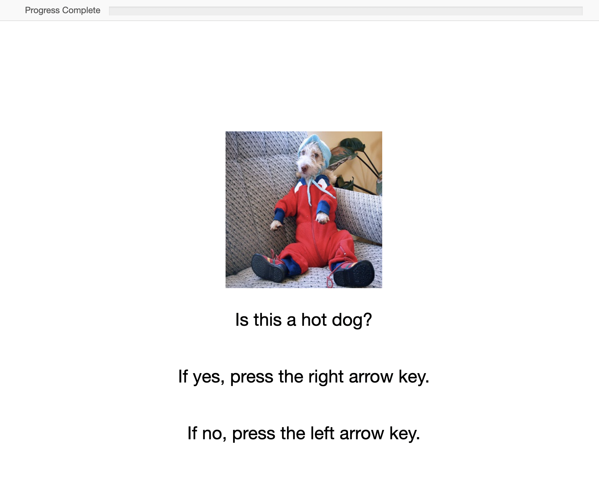

# Writing your experiment

Finally, let's stimulate our participant!

---

## Starting the development server

Your ROAR app is ready to go out of the box. Let's start the development server to see what the experiment looks like in the browser.

=== "code only"

    ```sh
    npm start
    ```

=== "screencast"

    <script id="asciicast-3BzroQXKrkJwROlvZPYSF3K8s" src="https://asciinema.org/a/3BzroQXKrkJwROlvZPYSF3K8s.js" async></script>

This will automatically open a new browser tab with your experiment. It should look something like the [experiment hosted here](https://create-roar-app-example.web.app/){target=_blank}:

[](https://create-roar-app-example.web.app/){target=_blank}

However, you're experiment will automatically update when you make changes to your source code.

## Adding another block of stimuli

Let's pretend that we want to add a new block to our experiment where we ask the participant to further differentiate between cats and dogs. Let's implement that structure now by first adding images of cats and dogs and then editing the experiment's source code to include those new images.

### Adding more images

The first step in creating our new block is hosting the images of dogs and cats that we will use as stimuli. Download these images to your computer

- [cat.zip](../assets/block-2-images/cat.zip)
- [dog.zip](../assets/block-2-images/dog.zip)

We will demonstrate two different ways to host images: we'll host the cat images along side your experiment and the dog images in a public google cloud storage bucket.

#### Hosting images alongside your experiment

=== "code only"

    First download the [cat images zip file](../assets/block-2-images/cat.zip). Assuming that this file was downloaded to `~/Downloads`, do

    ```sh
    # Make a folder for the cat images
    mkdir -p src/assets
    # Navigate to that folder
    cd src/assets
    # Move the downloaded zip file to this folder
    mv ~/Downloads/cat.zip .
    # Unzip the file
    unzip cat.zip
    # And delete the zip file
    rm cat.zip
    cd ../..
    ```

    Now edit the `src/loadAssets.js` file to load these new cat images. You can add individual files simply by importing them as variables and then referencing them in your code. For example

    ``` js title="src/loadAssets.js" linenums="1" hl_lines="3-10 34-38"
    import jsPsychPreload from '@jspsych/plugin-preload';

    import cat1 from './assets/cat/1.jpg';
    import cat2 from './assets/cat/2.jpg';
    import cat3 from './assets/cat/3.jpg';
    import cat4 from './assets/cat/4.jpg';
    import cat5 from './assets/cat/5.jpg';

    // Reference these files in a new array
    const catImages = [cat1, cat2, cat3, cat4, cat5];

    // Create arrays of hot dog / not hot dog images
    const numFiles = 5;
    const hotDogFiles = Array.from(Array(numFiles), (_, i) => i + 1).map(
      (idx) => `https://storage.googleapis.com/roar-hot-dog-images/hotdog/${idx}.jpg`,
    );

    const notHotDogFiles = Array.from(Array(numFiles), (_, i) => i + 1).map(
      (idx) => `https://storage.googleapis.com/roar-hot-dog-images/nothotdog/${idx}.jpg`,
    );

    const allFiles = hotDogFiles.concat(notHotDogFiles);
    export const allTargets = allFiles.map((url) => ({
      target: ``,
      isHotDog: !url.includes('nothotdog'),
    }));

    /* preload images */
    export const preloadImages = {
      type: jsPsychPreload,
      images: allFiles,
    };

    // Preload the cat image
    export const preloadCatImages = {
      type: jsPsychPreload,
      images: catImages,
    }
    ```

    And don't forget to commit your changes into git.

    ```sh
    git add src/assets/cat
    git add -u
    git commit -m "Add cat images for block 2"
    ```

=== "screencast"

    <script id="asciicast-mcEQabC4s6YIvnr1fYz6XdILP" src="https://asciinema.org/a/mcEQabC4s6YIvnr1fYz6XdILP.js" async></script>

#### Hosting images using a cloud storage provider

The above method of hosting image assets alongside your experiment is fine if you only have a few files. But it can become cumbersome to import each file separately if you have a lot of assets. Rather than hosting your files with your website, you can upload them to a cloud storage provider and access your files using a URL. To demonstrate, we have already uploaded the dog images to a Google Cloud Storage bucket. In fact, it is the same bucket that already hosts the hot dog vs. not hot dog images. You can see the images here
([1](https://storage.googleapis.com/roar-hot-dog-images/dog/1.jpg){target=_blank},
[2](https://storage.googleapis.com/roar-hot-dog-images/dog/2.jpg){target=_blank},
[3](https://storage.googleapis.com/roar-hot-dog-images/dog/3.jpg){target=_blank},
[4](https://storage.googleapis.com/roar-hot-dog-images/dog/4.jpg){target=_blank},
[5](https://storage.googleapis.com/roar-hot-dog-images/dog/5.jpg){target=_blank}).

Two popular cloud storage service providers are Google Cloud Storage (GCS) and Amazon Simple Storage Service (S3). To upload your own images and make them publicly available, follow these instructions:

- Create a storage bucket ([GCS instructions](https://cloud.google.com/storage/docs/creating-buckets), [S3 instructions](https://docs.aws.amazon.com/AmazonS3/latest/userguide/create-bucket-overview.html))
- Upload objects to the bucket ([GCS instructions](https://cloud.google.com/storage/docs/uploading-objects), [S3 instructions](https://docs.aws.amazon.com/AmazonS3/latest/userguide/upload-objects.html))
- Make the data public ([GCS instructions](https://cloud.google.com/storage/docs/access-control/making-data-public), [S3 instructions](https://docs.aws.amazon.com/AmazonS3/latest/userguide/WebsiteAccessPermissionsReqd.html))

Then we can add references to the dog image URLs like so

=== "code only"

    Edit the `src/loadAssets.js` file to include the dog image URLs

    ``` js title="src/loadAssets.js" linenums="1" hl_lines="22-24 38-48"
    import jsPsychPreload from '@jspsych/plugin-preload';

    import cat1 from './assets/cat/1.jpg';
    import cat2 from './assets/cat/2.jpg';
    import cat3 from './assets/cat/3.jpg';
    import cat4 from './assets/cat/4.jpg';
    import cat5 from './assets/cat/5.jpg';

    // Reference these files in a new array
    const catImages = [cat1, cat2, cat3, cat4, cat5];

    // Create arrays of hot dog / not hot dog images
    const numFiles = 5;
    const hotDogFiles = Array.from(Array(numFiles), (_, i) => i + 1).map(
      (idx) => `https://storage.googleapis.com/roar-hot-dog-images/hotdog/${idx}.jpg`,
    );

    const notHotDogFiles = Array.from(Array(numFiles), (_, i) => i + 1).map(
      (idx) => `https://storage.googleapis.com/roar-hot-dog-images/nothotdog/${idx}.jpg`,
    );

    const dogFiles = Array.from(Array(numFiles), (_, i) => i + 1).map(
      (idx) => `https://storage.googleapis.com/roar-hot-dog-images/dog/${idx}.jpg`,
    );

    const allFiles = hotDogFiles.concat(notHotDogFiles);
    export const allTargets = allFiles.map((url) => ({
      target: ``,
      isHotDog: !url.includes('nothotdog'),
    }));

    /* preload images */
    export const preloadImages = {
      type: jsPsychPreload,
      images: allFiles,
    };

    const block2Files = catImages.concat(dogFiles);
    export const block2Targets = block2Files.map((url) => ({
      target: ``,
      isDog: url.includes('dog'),
    }));

    // Preload the cat/dog images
    export const preloadBlock2Images = {
      type: jsPsychPreload,
      images: block2Files,
    };
    ```

=== "screencast"

    <script id="asciicast-CilcYmBcElKbDsCpNLZiK4i5T" src="https://asciinema.org/a/CilcYmBcElKbDsCpNLZiK4i5T.js" async></script>

??? info "Making sense of the above javascript"

    If the above line of javascript for `dogFiles` doesn't make sense to you, let's break it down into its components:
    
    ```js
    Array(numFiles)
    // Yields [ <5 empty items> ] since numFiles = 5

    Array.from(Array(numFiles), (_, i) => i + 1)
    // Yields [ 1, 2, 3, 4, 5 ]

    // And Finally
    Array.from(Array(numFiles), (_, i) => i + 1).map(
      (idx) => `https://storage.googleapis.com/roar-hot-dog-images/dog/${idx}.jpg`,
    );
    // Yields
    // [
    //   'https://storage.googleapis.com/roar-hot-dog-images/dog/1.jpg',
    //   'https://storage.googleapis.com/roar-hot-dog-images/dog/2.jpg',
    //   'https://storage.googleapis.com/roar-hot-dog-images/dog/3.jpg',
    //   'https://storage.googleapis.com/roar-hot-dog-images/dog/4.jpg',
    //   'https://storage.googleapis.com/roar-hot-dog-images/dog/5.jpg'
    // ]
    ```

    By using the [map method](https://developer.mozilla.org/en-US/docs/Web/JavaScript/Reference/Global_Objects/Array/map), we were able to write the URL pattern just once, following the [DRY principle](https://en.wikipedia.org/wiki/Don%27t_repeat_yourself). We use the map method again to convert the raw URLs in the `dogImages` array to HTML image tags in the `block2Targets` array.

### Adding a block of stimuli to `index.js`

Now that we have established references to our new cat vs. dog images, let's create the new block of stimuli. We'll introduce this first by adding only one single stimulus. and then we'll use the same code to add an entire block of stimuli using jsPsych's timeline variables.

#### Adding a single stimulus

We will add the first stimulus in the `block2Targets` array.

=== "code only"

    Edit the `src/index.js` file to include a new instruction set and the new stimuli.

    At the top of the file, add the following imports

    ```js title="src/index.js" linenums="11" hl_lines="4"
    // Local modules
    import { initConfig, initRoarJsPsych, initRoarTimeline } from './config';

    import { allTargets, preloadImages, block2Targets, preloadBlock2Images } from './loadAssets';
    ```
    
    Then, a little bit later in the file, add

    ```js title="src/index.js" linenums="71" hl_lines="3-45"
    timeline.push(hotDogTrials);

    const block2Instructions = {
      type: jsPsychHtmlKeyboardResponse,
      stimulus: `
        <h3>Great Job!</h3>
        <p>
          Now press the right arrow key if the displayed image is of a dog.
          Press the left arrow key if the displayed image is of a cat.
        </p>
        <p>Press any key to continue.</p>
        `,
    };

    timeline.push(preloadBlock2Images);
    timeline.push(block2Instructions);

    const catDogTrials = {
      timeline: [
        {
          type: jsPsychHtmlKeyboardResponse,
          stimulus: `<div style="font-size: 60px;">+</div>`,
          choices: 'NO_KEYS',
          trial_duration: 500,
        },
        {
          type: jsPsychHtmlKeyboardResponse,
          stimulus: block2Targets[0].target,
          choices: ['ArrowLeft', 'ArrowRight'],
          prompt: `
            <p>Is this a cat or a dog?</p>
            <p>If cat, press the left arrow key.</p>
            <p>If dog, press the right arrow key.</p>
            `
          data: {
            // Here is where we specify that we should save the trial to Firestore
            save_trial: true,
            // Here we can also specify additional information that we would like stored
            // in this trial in ROAR's Firestore database.
          },
        }
      ]
    };

    timeline.push(catDogTrials);
    ```

=== "screencast"

    <script id="asciicast-Fae6hjgPoGTYK98ISwIyYZ5nQ" src="https://asciinema.org/a/Fae6hjgPoGTYK98ISwIyYZ5nQ.js" async></script>

#### Adding a block of stimuli

We just added one single stimulus. It would be really annoying to have to write all that code over and over just to add the next nine stimuli for this block. Luckily, jsPsych has [timeline variables](https://www.jspsych.org/7.0/overview/timeline/#timeline-variables){target=_blank} to make this easier. In fact, the hot dog vs. not hot dog block already uses this technology. Let's add the other dog vs. cat stimuli using timeline variables with random sampling.

=== "code only"

    Edit the `catVsDogTrials` in the `src/index.js` file so that it reads:

    ```js title="src/index.js" linenums="88" hl_lines="10 29-33"
    const catDogTrials = {
      timeline: [
        {
          type: jsPsychHtmlKeyboardResponse,
          stimulus: `<div style="font-size: 60px;">+</div>`,
          choices: 'NO_KEYS',
          trial_duration: 500,
        },
        {
          type: jsPsychHtmlKeyboardResponse,
          stimulus: jsPsych.timelineVariable('target'),
          choices: ['ArrowLeft', 'ArrowRight'],
          prompt: `
            <p>Is this a cat or a dog?</p>
            <p>If cat, press the left arrow key.</p>
            <p>If dog, press the right arrow key.</p>
            `
          data: {
            // Here is where we specify that this trial is a test response trial
            task: 'test_response',
            // Here we can also specify additional information that we would like stored
            // in this trial in ROAR's Firestore database. For example,
            start_time: config.startTime.toLocaleString('PST'),
            start_time_unix: config.startTime.getTime(),
            timezone: Intl.DateTimeFormat().resolvedOptions().timeZone,
          }
        }
      ],
      timeline_variables: block2Targets,
      sample: {
        type: 'without-replacement',
        size: 10,
      },
    };
    ```

=== "screencast"

    <script id="asciicast-Hk9TDXjdOLudCfL4TPzLlSb3X" src="https://asciinema.org/a/Hk9TDXjdOLudCfL4TPzLlSb3X.js" async></script>

### Ending the experiment

We've added the second block of stimuli. Right now, the experiment abruptly ends after the last stimulus. It's a good idea to let your participants know that they've finished the experiment. Let's add one last trial telling the participant that they are done.

=== "code only"

    Add one more trial and push it to the timeline before the `exit_fullscreen` trial.

    ```js title="src/index.js" linenums="120" hl_lines="1-8"
    const endTrial = {
      type: jsPsychHtmlKeyboardResponse,
      stimulus: '<p>Great job! Press any key to finish the assessment.</p>',
      choices: 'ALL_KEYS',
      response_ends_trial: true,
    };

    timeline.push(endTrial);

    const exit_fullscreen = {
      type: jsPsychFullScreen,
      fullscreen_mode: false,
      delay_after: 0,
    };

    timeline.push(exit_fullscreen);
    ```

=== "screencast"

    <script id="asciicast-npcPshy7MAWkNTQDOUEFHXHVe" src="https://asciinema.org/a/npcPshy7MAWkNTQDOUEFHXHVe.js" async></script>

!!! warning "How to properly end your assessment"

    Be sure to give your participant concrete instructions for how to end the assessment. In this case, we told them to "press any key to finish the assessment." If you don't, then the participant might think that they are done and simply close the browser tab. Why is this bad? Although all of the trial information will be saved in the database, the assessment will not be counted as finished (either in the database or in the participant dashboard) because the jsPsych timeline did not complete.

    If you want to use any of jsPsych's audio plugins (e.g., [audio-button-response](https://www.jspsych.org/7.0/plugins/audio-button-response/) or [audio-keyboard-response](https://www.jspsych.org/7.0/plugins/audio-keyboard-response/)) to end the assessment
    be sure to specify `trial_ends_after_audio: true` so that the experiment automatically ends after the last audio file is played.
    Likewise, if you want to use any video plugins (e.g., [video-button-response](https://www.jspsych.org/7.0/plugins/video-button-response/) or
    [video-keyboard-response](https://www.jspsych.org/7.0/plugins/video-keyboard-response/)), be sure to specify `trial_ends_after_video: true` so that the experiment automatically ends after the last video.

    The guiding principle here is to ensure that the jsPsych timeline ends before the participant closes their browser tab.

## Advice for asset files

Please see [Common Issues > Advice For Asset Files](../common-issues/asset-files.md).
